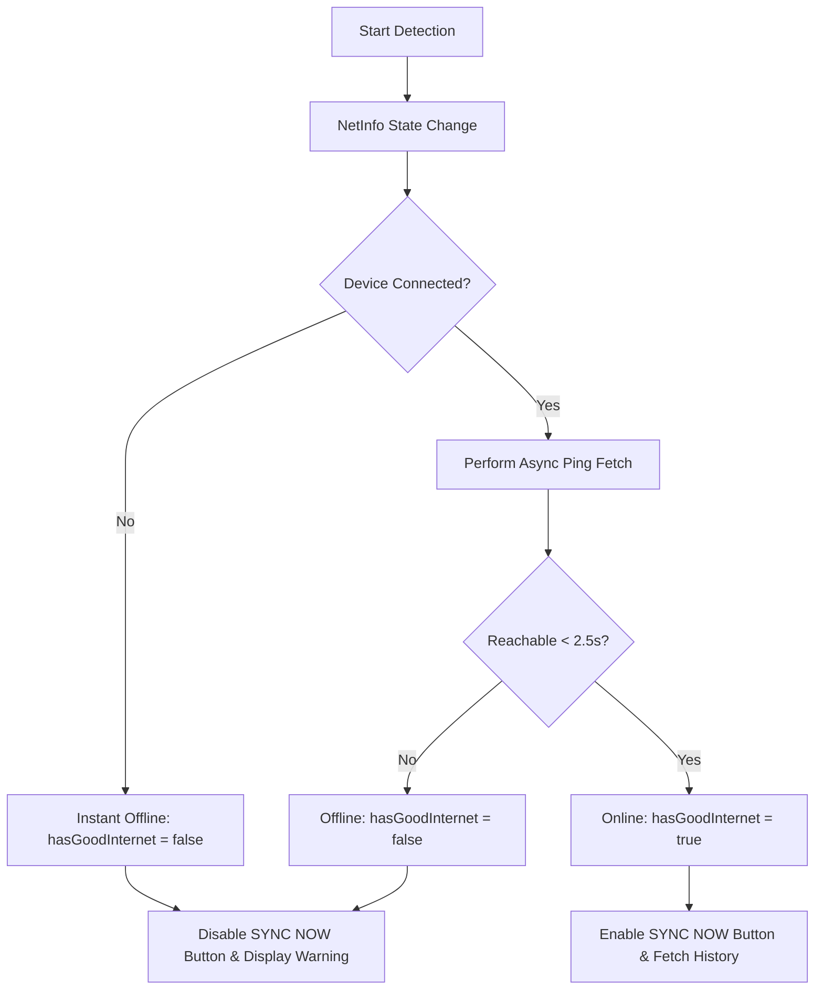

# Spec: Responsive Layout & Hybrid Offline Sync Dashboard

**Date:** 2026-06-01  
**Author:** Antigravity (Senior AI Coding Assistant)  
**Status:** Approved by User  

---

## 🎯 Objectives
Enhance the TDT Powersteel Kiosk `OfflineSync.tsx` dashboard to:
1.  Provide a fully responsive layout scaling across Phones, Small Tablets, and Large Tablets.
2.  Implement a highly reliable Hybrid Network Detector to lock down the **SYNC NOW** button when no actual internet connection exists.
3.  Implement a persistent local caching layer for **Today's History** so that the history list displays instantly on mount and works completely offline.

---

## 🏛 Architecture & Layout

### 1. Device Breakpoint Strategy
We will use reactive screen width queries provided by `useWindowDimensions()` to classify layouts:
-   **Phone (Small Screen):** `width < 480`
-   **Small Tablet (Medium Screen):** `480 <= width < 768`
-   **Tablet (Large Screen):** `width >= 768`

### 2. Layout Structure
Both the **Offline Queue** panel and **Today's History** panel remain visible at all times (no collapsible panels or closing buttons).

```
+-------------------------------------------------------------+
|                      Main Header                            |
+-------------------------------------------------------------+
|  TABLET (width >= 768)        |   MOBILE / SMALL TABLET     |
|  [Queue (0.6)] [History (0.4)]|   [ Queue Panel (1.1-1.2) ] |
|  Horizontal layout            |   [                       ] |
|                               |   ========================= |
|                               |   [ History Panel (0.8-0.9)]|
|                               |   Vertical stack layout     |
+-------------------------------------------------------------+
```

*   **Tablet (`width >= 768`):**
    *   Container: `flexDirection: 'row'`.
    *   Queue Panel: `flex: 0.6`.
    *   History Panel: `flex: 0.4`.
    *   Paddings: `20`, Card height: `80` (Standard).
*   **Small Tablet (`480 <= width < 768`):**
    *   Container: `flexDirection: 'column'`.
    *   Queue Panel: `flex: 1.1`.
    *   History Panel: `flex: 0.9`.
    *   Paddings: `16`, Card height: `74` (Compact).
*   **Phone (`width < 480`):**
    *   Container: `flexDirection: 'column'`.
    *   Queue Panel: `flex: 1.2` (Allocates more room for actions).
    *   History Panel: `flex: 0.8`.
    *   Paddings: `12`, Card height: `70` (Highly compact).

---

## 📡 Hybrid Network Detection (`useNetworkStatus` Hook)

A custom hook `useNetworkStatus.ts` will provide network state by combining fast network interface detection with background reachability checks.



### Technical Details
*   **Library:** `@react-native-community/netinfo`.
*   **Internet Ping:** Rapid HTTP `fetch` in the background to `${BACKEND_URL}/attendance_today.php` with a strict `2500ms` AbortController timeout.
*   **States:**
    *   `isConnected`: Boolean from NetInfo (instant router check).
    *   `hasGoodInternet`: Boolean representing actual end-to-end connectivity.
*   **UI Security Guard:** 
    *   If `!hasGoodInternet` or `isSyncing` is true, the **SYNC NOW** button is disabled, styled as semi-transparent (opacity `0.5`), and ignores clicks.
    *   A concise network status banner or badge will be displayed at the bottom or top of the Queue panel showing "Offline Mode - Sync Disabled" or "Online - Ready to Sync".

---

## 💾 Today's History Caching

To ensure the app "has something" offline, today's history list is stored persistently.

*   **Storage Key:** `@kiosk_today_history_cache`
*   **Implementation Flow:**
    1.  **Mount:** Read cache from AsyncStorage synchronously/asynchronously and populate `history` state instantly.
    2.  **Network Verified (Online):** Trigger `attendance_today.php` fetch.
    3.  **Successful Fetch:** Save returned JSON array to AsyncStorage and update `history` state.
    4.  **Failed Fetch / Offline:** Retain local cached history state (no error modal overlay, graceful degradation).

---

## 🧪 Testing Strategy
1.  **Mocking Network Transitions:** Verify the UI immediately disables and grays out the **SYNC NOW** button when network connection is severed.
2.  **Responsive Layout Verification:** Simulate layout widths (`375` for mobile, `600` for small tablet, `768` for standard tablet) to confirm beautiful adaptive stacking.
3.  **Offline State Cache Verification:** Turn off network, load screen, and confirm history items are still visible from cache.
