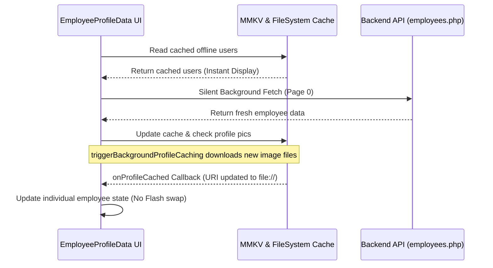
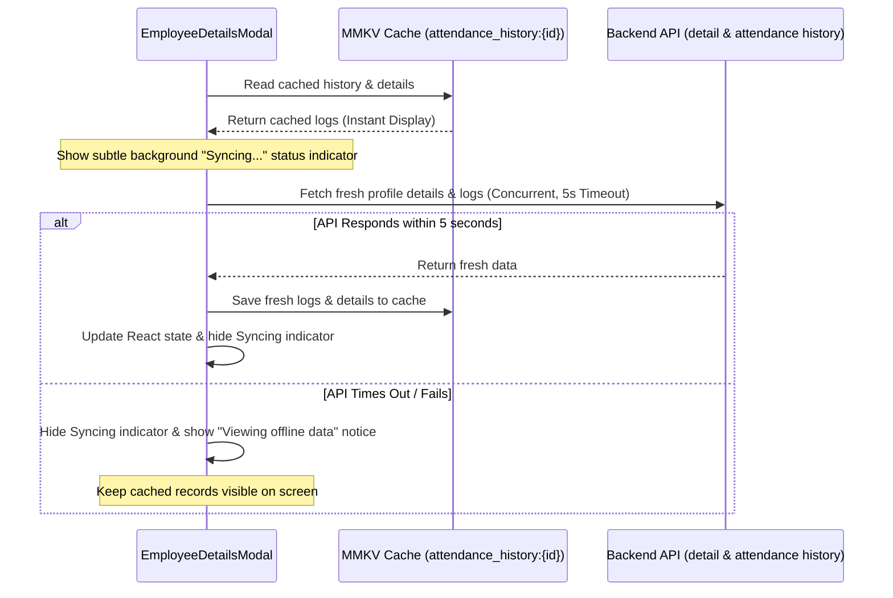

# Design Specification: Employee Directory Caching & Modal Timeout

## Status
* **Author:** Senior Software Engineer (Antigravity)
* **Date:** 2026-06-03
* **Status:** Under Review

---

## 1. Overview
The goal of this enhancement is to improve the user experience and offline reliability of the **Employee Directory** and the **Employee Details Modal** in the HRIS Kiosk application. 
Currently, the directory bootstrap process and the detail modal loading can block the user interface with spinners, especially on slow network connections. Furthermore, updates to employee profiles (like profile picture URL changes) are not dynamically updated in the UI, and fetching history has no timeout, leading to potential hangs.

This design implements a robust **Stale-While-Revalidate (SWR)** caching pattern using MMKV and local file caching, alongside a configurable **5-second timeout** for details and attendance history requests.

---

## 2. Goals & Requirements
* **Instant Loading:** Show cached directory data and modal details/logs immediately on mount/open.
* **Background Syncing (SWR):** Fetch fresh database records silently in the background, updating the local cache and UI without flashing or layout shifting.
* **Network Resilience:** Apply a strict 5-second timeout to all employee detail and history requests in the modal. Fall back to cached data gracefully if requests timeout or fail.
* **Dynamic Image Swapping:** Ensure that when a profile picture downloads in the background, the directory screen swaps the HTTP URL for the local `file://` URI dynamically in real-time.
* **Offline Accessibility:** Ensure the modal's attendance history displays logs offline if the Kiosk loses connectivity.

---

## 3. Architecture & Data Flow

### A. Employee Directory Caching Flow


### B. Employee Details Modal SWR & Timeout Flow


---

## 4. Implementation Details

### A. Employee Directory (`EmployeeProfileData.tsx` & `offlineUsers.ts`)
1. **Background Cache Swapping:**
   * Modify `triggerBackgroundProfileCaching` to accept an optional callback:
     ```typescript
     onProfileCached?: (userId: string, localUri: string) => void
     ```
   * As each batch image finishes downloading to disk, trigger `onProfileCached(user.userId, cachedUri)`.
2. **Dynamic UI Swapping:**
   * In `EmployeeProfileData.tsx`, instantiate the bootstrap call and pass the `onProfileCached` callback:
     ```typescript
     triggerBackgroundProfileCaching(incomingUsers, (userId, localUri) => {
       setEmployees(prev => prev.map(emp => {
         const logId = emp.log_id || normalizeAccount(emp.accounts)?.log_id;
         if (String(logId) === String(userId)) {
           const isArr = Array.isArray(emp.accounts);
           const acc = normalizeAccount(emp.accounts);
           const enrichedAcc = {
             ...acc,
             log_id: Number(userId),
             profile_picture: localUri
           };
           return {
             ...emp,
             accounts: isArr ? [enrichedAcc] : enrichedAcc
           };
         }
         return emp;
       }));
     });
     ```
   * Ensure that directory lists merge cleanly by checking keys and preventing visual jitter.

### B. Employee Details Modal (`EmployeeDetailsModal.tsx`)
1. **Caching Attendance History:**
   * Save the logs list under MMKV key: `attendance_history:${employee.emp_id}`.
2. **Non-blocking Mount & Fetch:**
   * On modal open, load the cached profile picture and name instantly.
   * Read `attendance_history:${employee.emp_id}` and set it as the initial `history` state.
   * Set a background-sync status state `isSyncing` to `true`.
3. **5-Second Timeout Implementation:**
   * Use a concurrent fetch approach utilizing `Promise.all` or independent try-catch blocks with `AbortController` timeouts set to 5000ms:
     ```typescript
     const controller = new AbortController();
     const timeoutId = setTimeout(() => controller.abort(), 5000);
     
     try {
       const [detailRes, historyRes] = await Promise.all([
         fetch(`${BACKEND_URL}/employees.php?detail_id=${empId}`, { signal: controller.signal }),
         fetch(`${BACKEND_URL}/record_attendance.php?emp_id=${empId}&...`, { signal: controller.signal })
       ]);
       // Parse and update state & MMKV cache...
     } catch (err) {
       // Catch AbortError or TypeError and display a subtle Toast or notice
     } finally {
       clearTimeout(timeoutId);
       setIsSyncing(false);
     }
     ```
4. **Subtle Sync Status UI:**
   * Remove the full-screen `ActivityIndicator` loading block if cached logs exist.
   * Add a small, spinning loader icon or "Syncing latest records..." text indicator at the top right of the modal's list panel.
   * If offline or timed out, display a small banner or text: `"Viewing cached data (Offline)"`.

---

## 5. Testing Plan
* **Instant Loading Verification:** Open the directory and details modal and verify that the UI populates instantly without showing full-screen blockers when cached data is present.
* **Background Sync Verification:** Verify that updates to database employee names or roles are reflected in the directory list seamlessly after a brief delay.
* **Profile Image Update Verification:** Mock a profile picture URL update on the backend and verify that the app downloads the picture and swaps it without a list reset.
* **Timeout Verification:** Mock network latency (> 5s) on the backend and ensure the modal cancels loading after 5 seconds and shows cached data with a warning notice.
* **Offline Verification:** Disable network connectivity and ensure the modal successfully displays cached logs instead of error screens.
