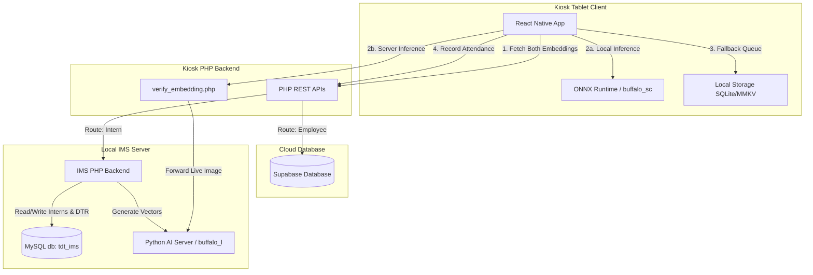

# HRIS Kiosk & IMS Registration - System Architecture

This document details the system architecture, data flow, and verification algorithms used in the **HRIS Attendance Kiosk** and the **Intern Management System (IMS) Registration Portal**.

---

## 1. System Topology Overview

The system architecture utilizes a hybrid offline-online strategy. Below is the network and component relationship diagram:

---

## 2. HRIS Kiosk Mobile App Architecture

The kiosk frontend is a React Native app built on Expo. It handles user identification via QR code, validates user identities on-device using a deep learning face embedding model, and records attendance.

### 2.1. Dual-Model Verification and Similarity Math
The architecture supports two deployment modes to balance tablet performance and recognition accuracy:

- **Local Mode**: The kiosk uses a lightweight local ONNX model (`buffalo_sc` / `w600k_mbf.onnx`) running directly on the device.
- **Server Mode**: The tablet offloads the image to the Kiosk PHP Backend, which proxies it to the Python AI Server to run inference using a high-accuracy, heavy model (`buffalo_l` / `w600k_r50.onnx`).

Regardless of the mode used, the following process occurs:
1. **Preprocessing**: The captured face image frame is cropped, resized to $112 \times 112$ pixels, normalized using $(pixel - 127.5) / 128.0$, and transposed to `CHW` (Channel-Height-Width) format before ONNX inference.
2. **Feature Extraction**: Inference yields a $1 \times 512$ floating-point feature vector (embedding) representing the face.
3. **Cosine Similarity**: The vector is compared against all registered reference angles for the user (using `face_embedding` for local mode, or `face_embedding_large` for server mode):
   $$\text{Similarity} = \frac{\mathbf{A} \cdot \mathbf{B}}{\|\mathbf{A}\| \|\mathbf{B}\|}$$
4. **Multi-Angle Verification Gate**:
   To prevent false rejects while maintaining high security, the matching algorithm enforces these boundaries:
   - **Main Match Threshold**: The highest similarity score across all registered angles must be **$\ge 0.52$**.
   - **Profile Agreement Rule**: At least **$1$** of the registered profile angles must score above the sub-threshold of **$\ge 0.45$**.

### 2.2. Liveness Check System
When enabled in Settings, the app uses a dual-liveness state machine:
- **Passive Liveness**: Compares bounding boxes and telemetry (e.g. eye aspect ratio, pitch, roll, yaw) in real time to detect human eye blinking or slight movement.
- **Active Liveness**: Instructs users to perform dynamic gestures (e.g., blinking or smiling) to guarantee physical presence.

### 2.3. Online-First Sync with Offline Fallback
- **Network Awareness**: Uses `@react-native-community/netinfo` and backend HTTP ping checks to determine connection quality.
- **Direct Online Recording**: When online, the app bypasses the offline queue and posts attendance directly to the backend server.
- **Offline Fallback Queue**: If connectivity fails, the app enqueues the attendance locally, increments `pendingSyncCount`, and returns a success modal to the user.
- **Background Sync Hook**: The [useAutoSync.ts](file:///C:/Users/Keith/HRIS/HRIS-KIOSK/src/utils/useAutoSync.ts) hook runs a periodic task (every 30s) that checks if connectivity is stable and automatically pushes queued logs to the server.

---

## 3. Kiosk Backend (PHP REST API)

The backend acts as a proxy and database router. It exposes stateless JSON endpoints to the Kiosk app.

- **`resolve_qr.php`**: Resolves the QR string (`LOG_ID:<id>` or `intern_<id>`).
  - **Employee**: Queries the Supabase `profiles` table to return employee metadata and serialized face embeddings (`face_embedding` and `face_embedding_large`).
  - **Intern**: Queries the MySQL `interns` table to return the name, status, and serialized face embeddings (`face_embedding` and `face_embedding_large`).
- **`record_attendance.php`**: Receives clock-in/out records.
  - **Employee**: Saves entries to Supabase `attendance`.
  - **Intern**: Proxies the POST request directly to the Intern Management System's internal API (`/api/record_intern_attendance.php`).
- **`verify_embedding.php`**: Validates embeddings if the device is configured in Server Mode. It forwards the live image to the Python Face Server requesting the `buffalo_l` model, and calculates cosine similarity against the `face_embedding_large` stored in the database.

---

## 4. IMS Registration Portal (Face Enrollment Subsystem)

The Intern Registration subsystem manages initial onboarding, profile verification, and face embedding capture.

### 4.1. Quality Control & Capture Guards
During enrollment in [register_intern.php](file:///C:/Users/Keith/HRIS/INTERN-MANAGEMENT-SYSTEM/register_intern.php), three core validation checks are applied:

1. **Center Boundary Circle Alignment**: 
   Ensures the face is correctly centered and sized. The script maps landmarks:
   - `10` (forehead)
   - `152` (chin)
   - `234` & `454` (left/right face boundaries)
   
   It calculates the distance from the coordinate center. The face must sit within a $95\text{px}$ radius boundary to prevent user standing too close or too far.
2. **Luminance/Brightness Check**:
   Calculates the average pixel brightness value of the camera frame. If the brightness is less than `50`, auto-capture is blocked to prevent noisy, dark photos.
3. **Glasses Presence Guideline**:
   Alerts the user to wear their glasses if they normally wear them, ensuring consistency between enrollment embeddings and kiosk verification embeddings.

### 4.2. Vector Extraction (Python Registration Server)
- The PHP registration frontend captures photos at five primary angles (Straight, Left, Right, Up, Down).
- Photos are sent to the Python embedding server ([face_server/app.py](file:///C:/Users/Keith/HRIS/HRIS-KIOSK/face_server/app.py)).
- The server extracts two 512-dimension vector sets for each angle: one using the fast `buffalo_sc` model, and another using the high-accuracy `buffalo_l` model.
- The vectors are JSON-serialized into 2D arrays and saved under the `face_embedding` and `face_embedding_large` columns respectively in the target database (MySQL for interns, Supabase for employees).
