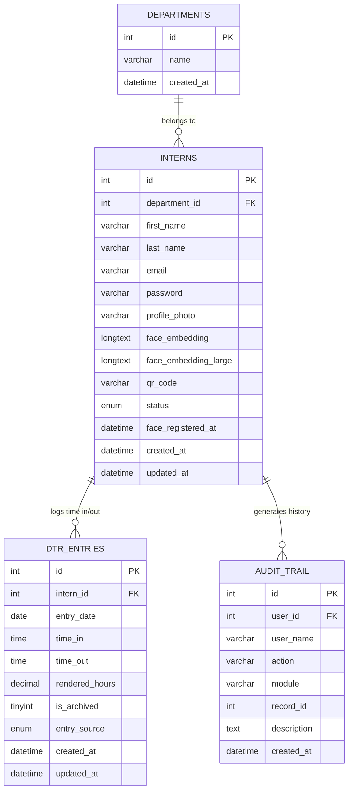
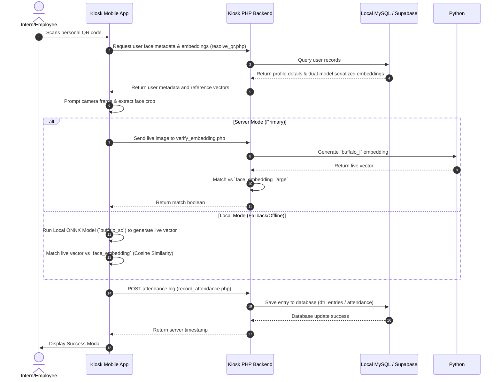
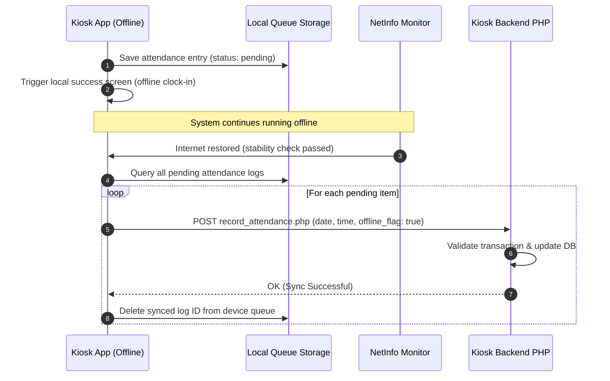

# HRIS Kiosk & IMS - System Design, Architecture, and ERD

This document contains the complete system design, architecture blueprints, Entity Relationship Diagrams (ERD), and database schemas for the **HRIS Kiosk** and the **Intern Management System (IMS)** enrollment portal.

---

## 1. System Design Goals & Principles

The HRIS Kiosk and IMS face verification system was designed around the following architectural principles:

- **Biometric Edge Processing**: Offloads heavy machine learning calculations to the client device (using ONNX Runtime on the mobile tablet) to achieve sub-second verification times without server bottlenecks.
- **Offline-First Resilience**: Ensures the kiosk functions during network outages by caching employee lists, validating identity against local records, and queueing attendance logs offline.
- **Stateless PHP Proxy**: Backend services remain stateless, routing queries dynamically to the appropriate cloud or local database engines.

---

## 2. Entity Relationship Diagram (ERD)

In **Intern Mode**, the system interacts with a local MySQL database (`tdt_ims`). Below is the data model showing relationships between departments, interns, attendance logs (DTR), and system audits.

### 2.1. Mermaid Database Relationship Model

---

## 3. Detailed Database Schemas

### 3.1. Intern Mode Local Database (`tdt_ims`)

#### Table: `departments`
Stores organizational department divisions for grouping interns and filtering supervisor routes.
- `id` (INT UNSIGNED, PK, AUTO_INCREMENT): Unique identifier.
- `name` (VARCHAR(100)): Department title (e.g., "Software Engineering", "Human Resources").
- `created_at` (DATETIME): Creation timestamp.

#### Table: `interns`
Holds user profile metadata and biometric reference structures for face scans.
- `id` (INT UNSIGNED, PK, AUTO_INCREMENT): Intern registration number.
- `department_id` (INT UNSIGNED, FK referencing `departments.id`): Department link.
- `first_name` / `last_name` / `middle_name` (VARCHAR(80)): Personal name details.
- `email` (VARCHAR(150), UNIQUE): Intern login email.
- `password` (VARCHAR(255)): Hashed portal credentials.
- `profile_photo` (VARCHAR(255)): Path to the base enrollment face photo.
- `face_embedding` (LONGTEXT): JSON-serialized array of five 512-dimensional float vectors using the lightweight `buffalo_sc` model.
- `face_embedding_large` (LONGTEXT): JSON-serialized array of five 512-dimensional float vectors using the high-accuracy `buffalo_l` model (used for Server Verification).
- `status` (ENUM('Active', 'Archived')): Access control flag.
- `face_registered_at` (DATETIME): Timestamp when face enrollment was completed.

#### Table: `dtr_entries`
Tracks individual time sheet sessions.
- `id` (INT UNSIGNED, PK, AUTO_INCREMENT): Unique entry key.
- `intern_id` (INT UNSIGNED, FK referencing `interns.id`): Intern link.
- `entry_date` (DATE): Log day (YYYY-MM-DD).
- `time_in` (TIME): Clock-in timestamp.
- `time_out` (TIME, NULLABLE): Clock-out timestamp.
- `rendered_hours` (DECIMAL(5,2)): Computed time difference (automatically updated on clock-out).
- `is_archived` (TINYINT(1), Default: 0): Soft delete flag.
- `entry_source` (ENUM('manual', 'kiosk')): Distinguishes kiosk-scanned entries from HR manual overrides.

#### Table: `audit_trail`
Provides transaction and security logs.
- `id` (INT UNSIGNED, PK, AUTO_INCREMENT): Audit sequence.
- `user_id` (INT UNSIGNED, FK): ID of the system admin or intern who triggered the log.
- `user_name` (VARCHAR(100)): Display name of the log initiator.
- `action` (VARCHAR(50)): CRUD action performed (e.g. `CREATE`, `UPDATE`).
- `module` (VARCHAR(50)): Target module (e.g. `DTR`, `Interns`).
- `record_id` (INT UNSIGNED): ID of the affected record in the target module.
- `description` (TEXT): Audit trail explanation details.
- `created_at` (DATETIME): Action execution timestamp.

---

### 3.2. Employee Mode Cloud Database (Supabase PostgreSQL)

In **Employee Mode**, all logs and profiles are managed via HTTPS POST REST queries to a Supabase PostgreSQL backend.

#### Table: `profiles`
Holds the employee demographics and dual-model face embeddings (`face_embedding` and `face_embedding_large`) corresponding to the MySQL `interns` table.

#### Table: `attendance`
- `att_id` (BIGINT, PK, AUTO_INCREMENT): Unique log sequence.
- `emp_id` (VARCHAR): Alphanumeric employee code.
- `date` (DATE): Attendance date.
- `timein` (TIME): Clock-in timestamp.
- `timeout` (TIME, NULLABLE): Clock-out timestamp.
- `location` (JSON): Geolocation snapshot `{ "latitude": float, "longitude": float, "address": string }` captured from kiosk sensors.

---

## 4. Key Sequence Flows

### 4.1. Edge Verification Sequence (Online Happy Path)
This sequence shows how the React Native client app verifies identity on-device and posts transactions online:

### 4.2. Offline Sync Loop
When network stability drops, the system caches transactions locally and automatically synchronizes them once Wi-Fi is restored:

